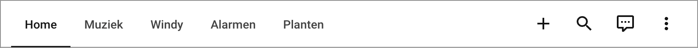
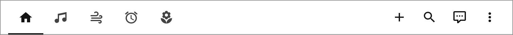
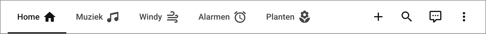
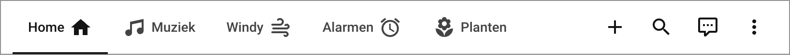

# Keep Texts in Tabs
[](https://github.com/hacs/integration)

#### Avoid removing texts from Home Assistant tabs when icons are added to them

In [Home Assistant] it is possible to create different [views] in a dashboard, each view will be accesible with a tab.



It is possible also, to add an icon to a view, and in that case, [the icon will be shown instead of the text](https://www.home-assistant.io/dashboards/views#view-icon) and the text will be used as the title of the icon.



However, it is not possible to have both, icons and texts, –something that it is rather basic–, one needs to chose between the both. This is when `keep-texts-in-tabs` comes to scene, this plugin makes it possible to keep the text and the icon in dashboard tabs.


>This feature was available before in [custom-header], this plugin is not aimed to replace `custom-header`, but to bring only the functionality of showing texts in views with icons, and no more.

## Installation

You need to install the plugin manually or through [HACS], not both. If you install the plugin using the two installations methods you could have issues or errors.

### Through HACS

The plugin is still not available in HACS default (it will be when [this](https://github.com/hacs/default/pull/2038) gets merged). For now, it should be installed through [HACS custom](https://hacs.xyz/docs/faq/custom_repositories/) adding https://github.com/elchininet/keep-texts-in-tabs to the custom repositories.

[//]: # "1. Go to `HACS` dashboard"
[//]: # "2. Go to `Frontend`"
[//]: # "3. Click on `Explore and download repositories` button in the bottom-right of the screen"
[//]: # "4. Search for `keep-texts-in-tabs` and install it"

### Manual installation

1. Download `keep-texts-in-tabs.js` from [the releases page](https://github.com/elchininet/keep-texts-in-tabs/releases/latest)
2. Put it inside your `config/www` folder
3. Reference the file from your dashboards depending on your dashboard management method described below:

#### If you are in storage mode (default mode)

1. Go to `Settings > Dashboards`
2. Click on the three dots located on the top-right corner and then click on `Resources`
3. Click on `ADD RESOURCE` on the bottom-right of the screen
4. Add the URL to the file that you have downloaded previously (e.g `/local/keep-texts-in-tabs.js?v=1.0.0`)
5. Make sure you add the correct version at the end of the URL (e.g. `?v=1.0.0`) because in this way you make Home Assistant to load the new version instead of a version stored in cache

#### If you are in yaml mode

1. Go to your desired dashboard yaml file
2. Add the URL to the file that you have downloaded previously below the `resources` section

```yaml
resources:
  - url: /local/keep-texts-in-tabs.js?v=1.0.0
    type: module
```

4. Make sure you add the correct version at the end of the URL (e.g. `?v=1.0.0`) because in this way you make Home Assistant to load the new version instead of a version stored in cache

## Configuration

Configuration also depends on your dashboard management method:

#### If you are in storage mode (default mode)

1. Go to the dashboard in which you want to add the configuration
2. Click on the three dots located on the top-right corner and then click on `Edit Dashboard`
3. Click again on the three dots located on the top-right corner and then click on `Raw configuration editor`
4. Add the configuration at the very beginning of the the code

#### If you are in yaml mode

1. Go to the dashboard yaml file in which you want to add the configuration
4. Add the configuration at the very beginning of the the code

## Configuration options

By default, if you enable `keep-texts-in-tabs`, all the views that are using icons, will have the proper text after the icon in the tabs, but you can customise it with some options.

### enabled

Enables the plugin, if you do not set this option, the tabs will not be affected.

| Values   | Default | Description                     |
| -------- | ------- | ------------------------------- |
| `true`   | no      | Enables the plugin              |
| `false`  | yes     | Disables the plugin             |

#### Example

```yaml
keep_texts_in_tabs:
  enabled: true
```


### position

Controls the text position with repect to the icon

| Values   | Default | Description                     |
| -------- | ------- | ------------------------------- |
| `after`  | yes     | Places the text after the icon  |
| `before` | no      | Places the text before the icon |

#### Example

```yaml
keep_texts_in_tabs:
  enabled: true
  position: before
```



---

### include

Control which tabs will be the ones affected by the plugin

#### Example

```yaml
keep_texts_in_tabs:
  enabled: true
  include:
    - Muziek
    - Alarmen
```


---

### exclude

Control which tabs will not be affected by the plugin

#### Example

```yaml
keep_texts_in_tabs:
  enabled: true
  exclude:
    - Windy
    - Planten
```


>Note: you cannot have `include` and `exclude` parameters at the same time in a configuration, if you do that, you will get an error.

---

### override

Overrides the global position of the text in certain tabs (if the global option is `after`, it will force the position to `before` on the selected tabs and vice versa)

#### Example

```yaml
keep_texts_in_tabs:
  enabled: true
  position: before
  override:
    - Muziek
    - Planten
```



### mobile_config

If this options is not used, the same configuration will be used for desktop and mobile devices. If it is used, it allows one to set a special configuration only for mobile (all the previous options will be available)

#### Example

```yaml
keep_texts_in_tabs:
  enabled: true
  mobile_config:
    enabled: false  
```

### mobile_screen_width

This option can only be placed inside `mobile_config`. By default, mobile devices will be those with screen sizes equal or below `640px`. This options allows one to select a different value.

#### Example

```yaml
keep_texts_in_tabs:
  enabled: true
  position: before
  mobile_config:
    enabled: true
    mobile_screen_width: 340
```

[Home Assistant]: https://www.home-assistant.io/
[custom-header]: https://github.com/maykar/custom-header
[views]: https://www.home-assistant.io/dashboards/views
[HACS]: https://hacs.xyz